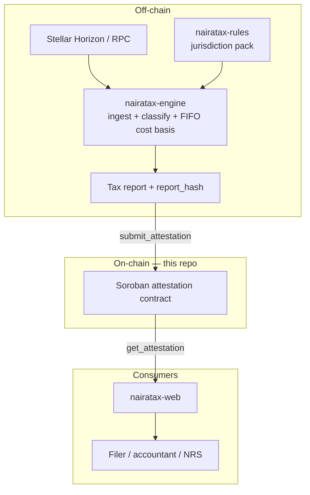

# NairaTax Contracts

[](https://stellar.org)
[](https://soroban.stellar.org)
[](#license)

On-chain attestation layer for [NairaTax](https://github.com/nairatax-xyz) — anchors the hash of a generated Stellar tax report on Soroban so a filing can later be proven unaltered.

## Overview

NairaTax reads a Stellar account's real activity, classifies it into taxable events, computes cost basis, and applies a jurisdiction's rules to produce a filing-ready report — starting with Nigeria. That whole pipeline is off-chain, in `nairatax-engine`. This repo, `nairatax-contracts`, is the optional on-chain layer: a minimal Soroban contract whose only job is to record report hashes so they can later be independently verified.

### The problem

A tax report generated off-chain is only as trustworthy as the process that produced it. Once a report leaves `nairatax-engine`, nothing stops it from being edited after the fact — by the filer, by a compromised export step, or by simple file corruption — with no way for a user, an accountant, or the NRS to tell whether the numbers in front of them match what was actually computed.

Nigeria's Tax Act 2025 also puts the NRS in a position to cross-reference exchange and on-chain data directly. A report that can be independently verified against an immutable anchor is a stronger artifact than a PDF someone says they didn't touch.

### What this contract does — and doesn't — do

- `nairatax-engine` computes a report and its hash.
- This contract records `submit_attestation(report_hash, account, period)`.
- Anyone — the filer, an accountant, the NRS — can later call `get_attestation(report_hash)` and confirm a given report file hashes to something that was anchored at a specific ledger timestamp.

Everything downstream of "does this hash match" — the tax calculation, the rule pack, the review UI — stays off-chain in `nairatax-engine` and `nairatax-rules`. No PII, no report contents, and no funds ever touch this contract; it only ever stores a hash, an account, a period, and a timestamp.

## Status

Implemented and unit-tested. Not yet deployed to Testnet or Mainnet, and not yet wired up as a `nairatax-engine` client.

## Architecture



## Repository structure

```
nairatax-contracts/
├── Cargo.toml                        # workspace manifest
├── rust-toolchain.toml               # pins stable + wasm32v1-none target
└── contracts/
    └── attestation/
        ├── Cargo.toml
        └── src/
            ├── lib.rs                # contract entry points
            ├── types.rs              # Attestation struct
            ├── storage.rs            # DataKey storage schema
            ├── events.rs             # AttestationSubmitted event
            ├── errors.rs             # contract error codes
            └── test.rs               # unit tests
```

## Contract interface

```rust
pub struct Attestation {
    pub report_hash: BytesN<32>,  // SHA-256 of the canonical report
    pub account: Address,          // Stellar account the report covers
    pub period: Symbol,            // e.g. "2026" or "2026Q1"
    pub timestamp: u64,            // ledger timestamp at submission
}
```

| Function | Auth | Role |
|---|---|---|
| `init(admin: Address)` | none (callable once) | Sets the sole account authorised to call `submit_attestation`. A second call fails with `AlreadyInitialized`. |
| `submit_attestation(submitter, report_hash, account, period)` | `submitter` must equal the configured admin | Anchors a report hash on-chain. Fails with `AttestationExists` if the hash was already anchored — attestations are append-only, never overwritten. |
| `get_attestation(report_hash) -> Option<Attestation>` | none | Read-only lookup, callable by anyone. |

### Errors

| Code | Name | Meaning |
|---|---|---|
| 1 | `NotInitialized` | `submit_attestation` called before `init`. |
| 2 | `AlreadyInitialized` | `init` called a second time. |
| 3 | `NotAuthorized` | `submitter` is not the configured admin. |
| 4 | `AttestationExists` | `report_hash` was already anchored. |

### Events

`submit_attestation` publishes an `AttestationSubmitted` event topic-indexed by `report_hash`, carrying `account`, `period`, and `timestamp` — so off-chain services can watch for new anchors without polling `get_attestation`.

## Building and testing

Requires the Rust stable toolchain with the `wasm32v1-none` target (pinned in `rust-toolchain.toml`).

```bash
# run unit tests
cargo test

# build the wasm contract
cargo build --target wasm32v1-none --release
```

## Why this matters for NairaTax

- **For filers** — a report that can be shown to match what was actually computed, not just what's in a downloaded file.
- **For accountants** — an independent, tamper-evident timestamp for when a set of figures was produced.
- **For the NRS / auditors** — a verifiable anchor that doesn't require trusting NairaTax's servers, only the Stellar ledger.
- **For the Stellar ecosystem** — a small, concrete example of Soroban used for verifiable record-keeping rather than DeFi.

## License

MIT — see [LICENSE](LICENSE).

## NairaTax organization

This repo is one of several in the NairaTax organization. If a change here touches the `Attestation` schema, call it out so `nairatax-engine` and `nairatax-web` can be updated to match.

| Repo | Role |
|---|---|
| `nairatax-xyz` | Org landing, roadmap, project board |
| `nairatax-engine` | Ledger ingestion, event classification, FIFO cost basis, report generation |
| `nairatax-web` | Frontend — dashboard, review/tag UI, reports, export |
| `nairatax-rules` | Jurisdiction rule packs as auditable data (e.g. `nigeria-nta-2025`) |
| **`nairatax-contracts`** *(this repo)* | On-chain attestation layer for report hashes |
| `nairatax-docs` | Methodology, filing guides, developer + user docs |
